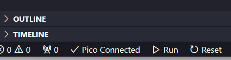
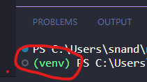
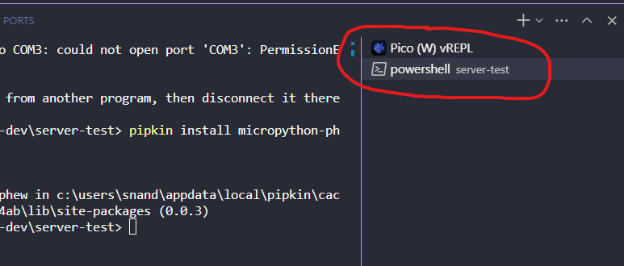

# VSCode MicroPython and Pico

For now this is just some notes I am making on using VSCode as an alternative to Thonny

## Justification:
- Get to use code completion along with other benefits of VSCode (linting etc)
- Is good if you are already familiar with VSCode
- VSCode supports venv from system terminal, which, for some reason I needed to enable use of pipkin for installing packages to pico

Note: The following assumes you have installed the correct MicroPython firmware for your pico first. [See here for more info](https://www.raspberrypi.com/documentation/microcontrollers/micropython.html)


## Let's go! Getting Started
- Open VSCode
- Open Extensions on left tool bar
- Search for "MicroPico", this brings up 1 result for me by "paulober", install this extension
- Ensure you are not running a serial connection elsewhere to your connected pico (e.g. in Thonny)
- Open a folder in VSCode to develop from
- Open the command palette (View > Command Palette) and run MicroPico > Configure Project
- The above command will import stubs for autocompletion and the settings into your project folder. For the auto-completion to work, the extension prompts you (after project configuration) to install recommended extensions mentioned (install them if you don't have them already)
- Create a python file in the open directory and enter the following code:

```python
from machine import Pin
from time import sleep

pin = Pin("LED", Pin.OUT)

while True:
    pin.toggle()
    sleep(1)
```
- Ensure you can see that your pico is connected in the bottom left corner of VSCode



- Run your code by right clicking the python file in VSCode and select "Run current file on Pico"

## Other Bits (Hints and Tips)

### Using pipkin to install packages directly to Pico

This requires Python to be installed on your machine
- Open a terminal in VSCode (Terminal > New Terminal) and run the following
```
python -m venv venv
```
- Activate the virtual environment:
  - On Windows: venv\Scripts\activate
  - On Mac/Linux: source venv/bin/activate
- Close the terminal and open a new one (Click the bin icon in terminal window top right corner, then Terminal > New Terminal)
- Ensure VSCode is now using your virtual environment:

- Install pipkin
```
pip install pipkin
```
- Installing packages with pipkin will not work if there is an active serial connection to the pico, disconnect by clicking "Pico Connected" in the bottom left of your VSCode window, this will toggle to "Pico Disconnected"
- Try installing micropython-phew, [a nice little webserver library](https://pypi.org/project/micropython-phew/) maintained by Sheffield's own [Pimoroni](https://shop.pimoroni.com/)
```
pipkin install micropython-phew
```

### Where are my Pico's files?

You can view the Pico filesystem just like in Thonny:
- Open the Command Palette (View > Command Palette)
- Run MicroPico > Toggle Virtual File System
- The Pico filesystem opens as branch in your VSCode workspace

### Which terminal am I using?

You can switch between the Pico vREPL and your system terminal on the right of the VSCode terminal window:
